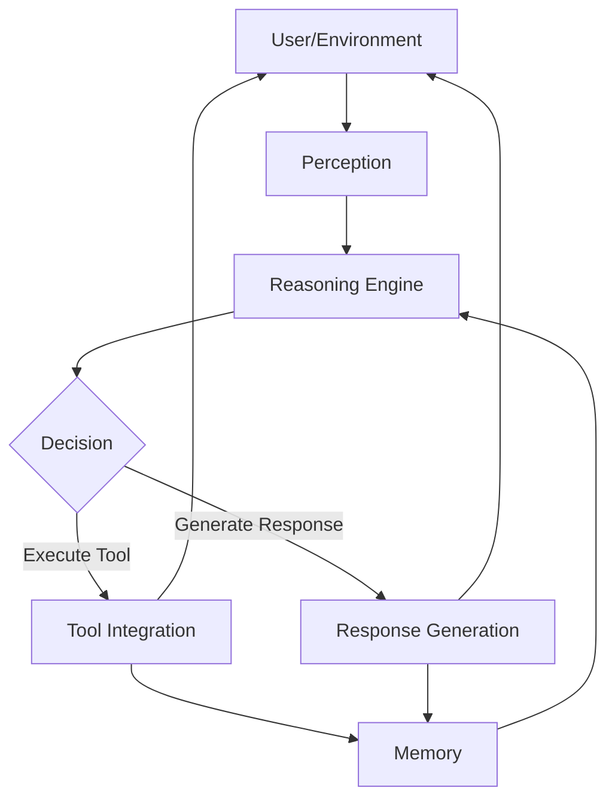
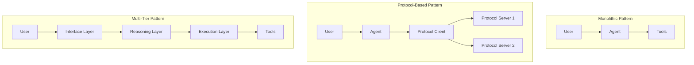
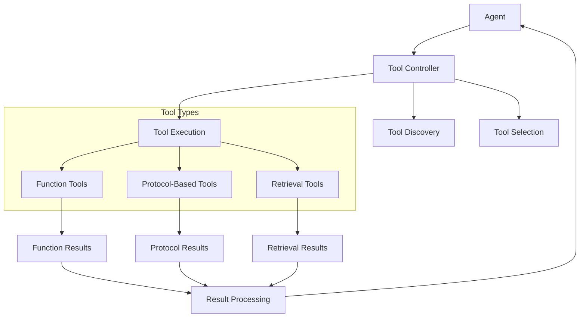
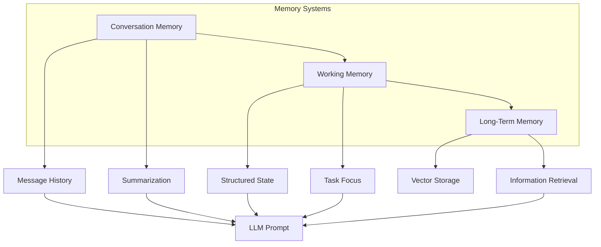
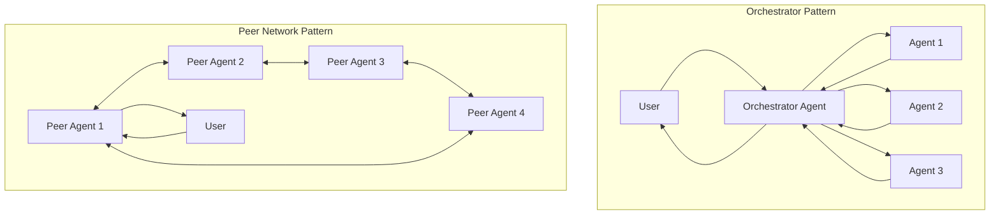
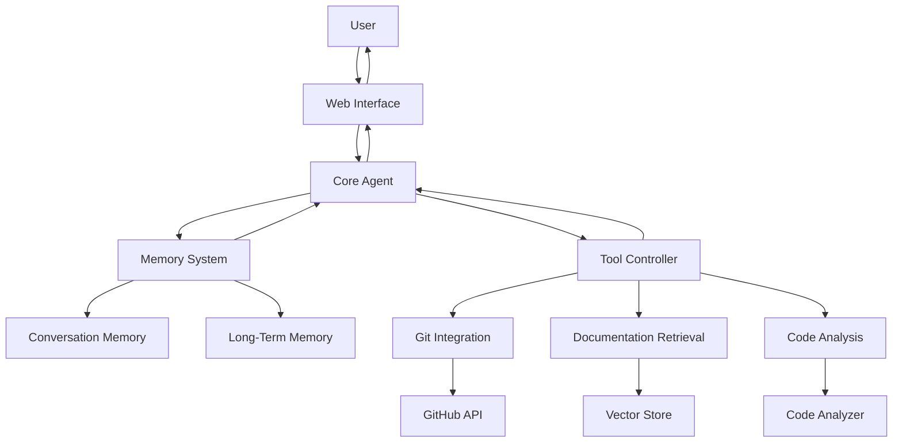

# Agentic AI Design Patterns
## Designing Intelligent Systems for Autonomous Action

*Final Outline for 30-page Edition*

---

## Introduction

This book will serve as an essential guide for software engineers building agent systems, with a clear emphasis on practical patterns they can implement today.

The book will maintain the concise, actionable approach readers expect while providing a foundation that can be expanded in future editions.

---

## Chapter 1: Building Blocks of Software Agents (5 pages)

**Pitch:** Every successful agent architecture is built on fundamental components working in concert. This chapter provides software engineers with a clear mental model of agent architecture, introducing the essential elements they'll need to implement effective agent systems.

**JTBD:**
- Establish a common vocabulary for discussing agent architectures
- Understand the key components of modern LLM-powered agents
- Recognize the architectural challenges specific to agent systems

**Key Sections:**
1. **Agents vs. Traditional Applications**
   - LLMs as reasoning engines
   - Key differences in architecture requirements

2. **Core Agent Components**
   - Perception: How agents process inputs
   - Reasoning: LLM integration patterns
   - Action: Tool execution frameworks
   - Memory: State management approaches

3. **The Agent Loop**
   - Basic flow: Observe → Think → Act
   - Managing context throughout the loop
   - Error handling and recovery

4. **Evaluating Agent Architectures**
   - Reliability and robustness metrics
   - Extensibility considerations
   - Performance evaluation approaches

**Examples:**
- Anatomy of a simple GitHub-integrated coding agent
- Comparison of architectures: simple chat vs. autonomous agent

**Visualization:**

## Chapter 2: Core Architectural Patterns (7 pages)

**Pitch:** The foundational architecture of your agent system determines its capabilities, limitations, and future extensibility. This chapter presents battle-tested patterns for structuring your agent's core components, with clear guidance on which pattern best suits different requirements.

**JTBD:**
- Select the appropriate architectural pattern for specific agent requirements
- Understand the trade-offs between different architectural approaches
- Implement the chosen pattern with best practices

**Key Sections:**
1. **Monolithic Agent Pattern**
   - Structure and implementation
   - When to use: Simple agents with focused capabilities
   - Code example: Basic implementation structure
   - Key considerations and limitations

2. **Protocol-Based Agent Pattern**
   - Structure and implementation
   - When to use: Extensible agents with diverse tool needs
   - MCP and other integration protocols
   - Code example: Implementing protocol-based tool discovery

3. **Multi-Tier Agent Pattern**
   - Structure and implementation
   - When to use: Complex agents with specialized processing needs
   - Code example: Separating reasoning from execution
   - Key considerations and limitations

4. **Event-Driven Agent Pattern**
   - Structure and implementation
   - When to use: Agents responding to asynchronous events
   - Code example: Event handling implementation
   - Key considerations and limitations

**Examples:**
- Single-purpose vs. multi-purpose agent architecture comparison
- Case study: Refactoring from monolithic to protocol-based architecture

**Visualization:**

## Chapter 3: Tool Integration Patterns (6 pages)

**Pitch:** The true power of agent systems comes from their ability to interact with external tools and services. This chapter provides patterns for robust, maintainable tool integrations that extend your agent's capabilities beyond conversation.

**JTBD:**
- Implement reliable tool calling mechanisms
- Create discoverable, self-describing tool interfaces
- Manage tool execution context and error handling

**Key Sections:**
1. **Function Calling Pattern**
   - Structure and implementation
   - Tool description best practices
   - Parameter handling and validation
   - Error handling and recovery
   - Code example: Implementing robust function calls

2. **Protocol-Based Tool Integration**
   - MCP for standardized tool access
   - Tool description and discovery
   - Authentication and security considerations
   - Code example: Consuming MCP-based tools

3. **Retrieval Augmentation Pattern**
   - Knowledge integration as a special tool type
   - Query formulation strategies
   - Result processing and incorporation
   - Code example: Implementing effective RAG

4. **Tool Composition Pattern**
   - Building complex capabilities from simple tools
   - Tool orchestration approaches
   - Code example: Implementing tool workflows

**Examples:**
- Integrating database access using function calls
- Implementing MCP for external API access
- Building a document processing pipeline with composed tools

**Visualization:**

## Chapter 4: Memory and State Patterns (6 pages)

**Pitch:** Effective agents require sophisticated memory systems to maintain context, learn from interactions, and manage complex tasks. This chapter presents patterns for different types of agent memory, with guidance on implementing memory systems that enhance agent capabilities without overwhelming computational resources.

**JTBD:**
- Implement appropriate memory systems for different agent needs
- Manage conversation history effectively within context limits
- Create persistent memory for long-term agent effectiveness

**Key Sections:**
1. **Conversation Memory Pattern**
   - Structure and implementation
   - Context window management strategies
   - Summarization approaches
   - Code example: Building efficient conversation memory

2. **Working Memory Pattern**
   - Structure and implementation
   - Task-focused state management
   - Attention mechanisms
   - Code example: Implementing goal-directed working memory

3. **Long-Term Memory Pattern**
   - Structure and implementation
   - Vector storage approaches
   - Retrieval mechanisms
   - Code example: Building persistent agent memory

4. **Memory Optimization Techniques**
   - Compression strategies
   - Selective retention algorithms
   - Chunking and summarization methods
   - Code example: Implementing advanced memory management

**Examples:**
- Managing context for a multi-turn customer support agent
- Implementing working memory for a research assistant agent
- Building long-term memory for a personal productivity assistant

**Visualization:**

## Chapter 5: Multi-Agent Patterns (5 pages)

**Pitch:** Complex tasks often require multiple agents working together, each with specialized capabilities. This chapter presents patterns for designing and implementing multi-agent systems that distribute work effectively while maintaining coherent overall behavior.

**JTBD:**
- Design effective multi-agent architectures
- Implement reliable agent communication and coordination
- Balance autonomy and control in multi-agent systems

**Key Sections:**
1. **Orchestrator Pattern**
   - Structure and implementation
   - Task decomposition strategies
   - Result aggregation approaches
   - Code example: Building an orchestrator agent

2. **Peer Network Pattern**
   - Structure and implementation
   - Communication protocols
   - Consensus mechanisms
   - Code example: Implementing peer-to-peer agent communication

3. **Specialization Pattern**
   - Structure and implementation
   - Agent specialization strategies
   - Task routing approaches
   - Code example: Building specialized agent teams

4. **Communication Protocols**
   - Message formats and standards
   - State synchronization approaches
   - Error handling in distributed systems
   - Code example: Implementing robust agent communication

**Examples:**
- Building a research team with specialized agents for different tasks
- Implementing a debate between multiple perspectives using peer agents
- Creating a document processing pipeline with specialized agents

**Visualization:**

## Chapter 6: Case Study: Building a Retrieval-Enhanced Development Assistant (1 page)

**Pitch:** This capstone chapter brings together the patterns from previous chapters into a coherent, complete example. By following the development of a practical coding assistant, readers will see how different patterns combine to create a powerful agent system.

**JTBD:**
- Understand how different patterns work together in a real system
- Identify architectural considerations for specific use cases
- Apply the book's patterns to similar development challenges

**Key Sections:**
1. **Assistant Requirements**
   - Capabilities and constraints
   - User interaction patterns
   - Performance considerations

2. **Architecture Overview**
   - Pattern selection and rationale
   - Component interaction diagram
   - Implementation considerations

3. **Key Implementation Details**
   - Protocol selection for tool integration
   - Memory system design
   - Error handling approach

4. **Lessons Learned**
   - Pattern adaptations for specific needs
   - Performance optimizations
   - Future extension opportunities

**Example:**
- Complete architecture of a GitHub-integrated coding assistant that retrieves relevant documentation and code examples

**Visualization:**

---

## Appendix A: Pattern Quick Reference (½ page)

A condensed reference of all patterns covered in the book, with one-line descriptions and page references.

## Future Topics for Expanded Edition (½ page)

Brief overview of advanced topics to be covered in the full edition, including:
- Agent security patterns
- Evaluation and monitoring patterns
- Learning and adaptation patterns
- Multi-modal agent patterns
- Deployment and scaling patterns
