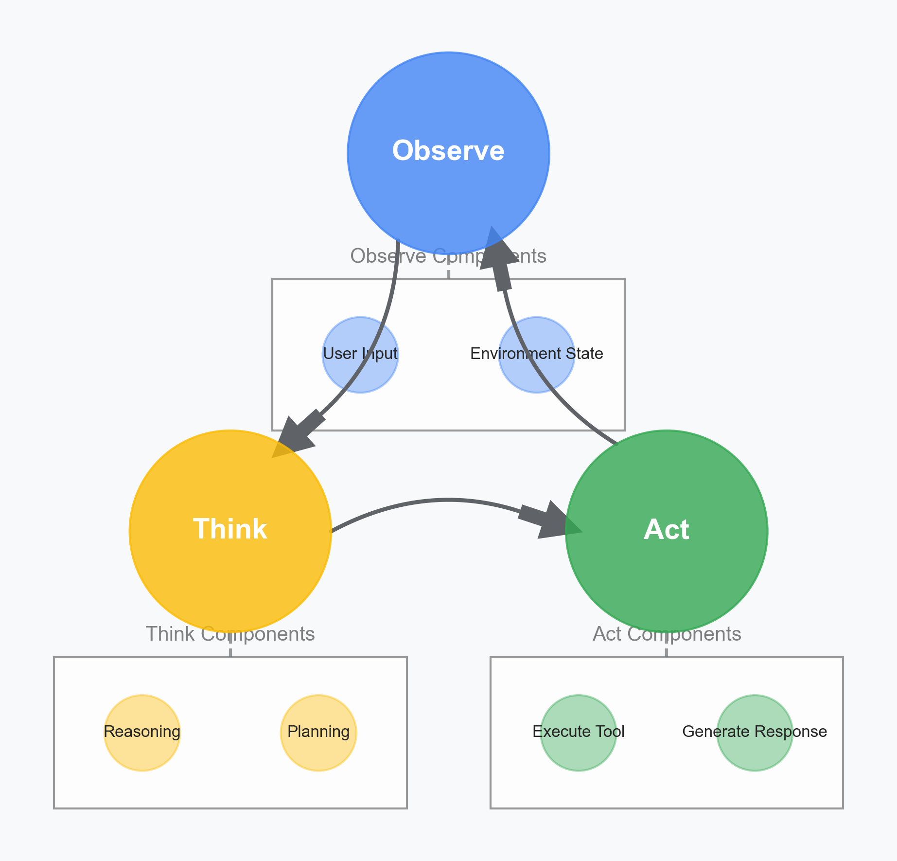

# Chapter 1: Building Blocks of Software Agents

## Introduction

AI agents represent a paradigm shift from traditional applications, combining the reasoning capabilities of large language models with the ability to take concrete actions. This chapter explores the fundamental components that make up effective agent systems, providing software engineers with a clear architectural foundation.

## The Agent Loop

At the heart of every agent system is the fundamental loop of observation, reasoning, and action. This loop creates a continuous cycle of interaction with the environment, allowing agents to perceive, process, and respond to changing conditions.

<figure>
  
  <figcaption>Figure 1.1: The agent loop illustrates the fundamental cycle of observation, reasoning, and action that drives all agent systems. Each phase feeds into the next, creating a continuous process of environmental interaction.</figcaption>
</figure>

Let's explore each component of this loop:

### Observation

The observation phase is where the agent gathers information from its environment. This information can come from:

- **User Input**: Direct communication from users in the form of text, voice, or other modalities
- **Environment State**: Data from systems, sensors, or other sources that provide context

Effective observation components must handle various input types, manage different data formats, and prioritize relevant information for the agent's reasoning process.

### Reasoning

In the reasoning phase, the agent processes the observed information to understand the current situation and determine appropriate actions. This includes:

- **Analysis**: Breaking down complex information into meaningful patterns
- **Planning**: Formulating approaches to achieve goals based on the current state
- **Decision-making**: Selecting the most appropriate course of action

For LLM-powered agents, this reasoning process is primarily handled by the language model itself, with appropriate prompting and context management.

### Action

The action phase involves executing the decisions made during reasoning. Actions typically fall into two categories:

- **Tool Execution**: Invoking external systems, APIs, or functions to perform specific tasks
- **Response Generation**: Creating appropriate textual or multimodal responses for users

The action phase must include robust error handling, result validation, and state management to ensure reliability.

## Core Agent Components

Beyond the basic loop, agent architectures require several key components that work together to create effective systems:

1. **Tool Integration Framework**: Standardized approaches for connecting to external capabilities
2. **Memory Systems**: Methods for maintaining context across multiple interactions
3. **Planning Mechanisms**: Structures for breaking complex tasks into manageable steps
4. **Self-monitoring Systems**: Capabilities for detecting and recovering from errors

In the following chapters, we'll explore specific patterns for implementing each of these components, with concrete code examples and architectural recommendations.

## References

- Large Language Model Agent Architecture Patterns
- The Agent-Based View of AI Systems
- Cognitive Architecture Models for AI Agents