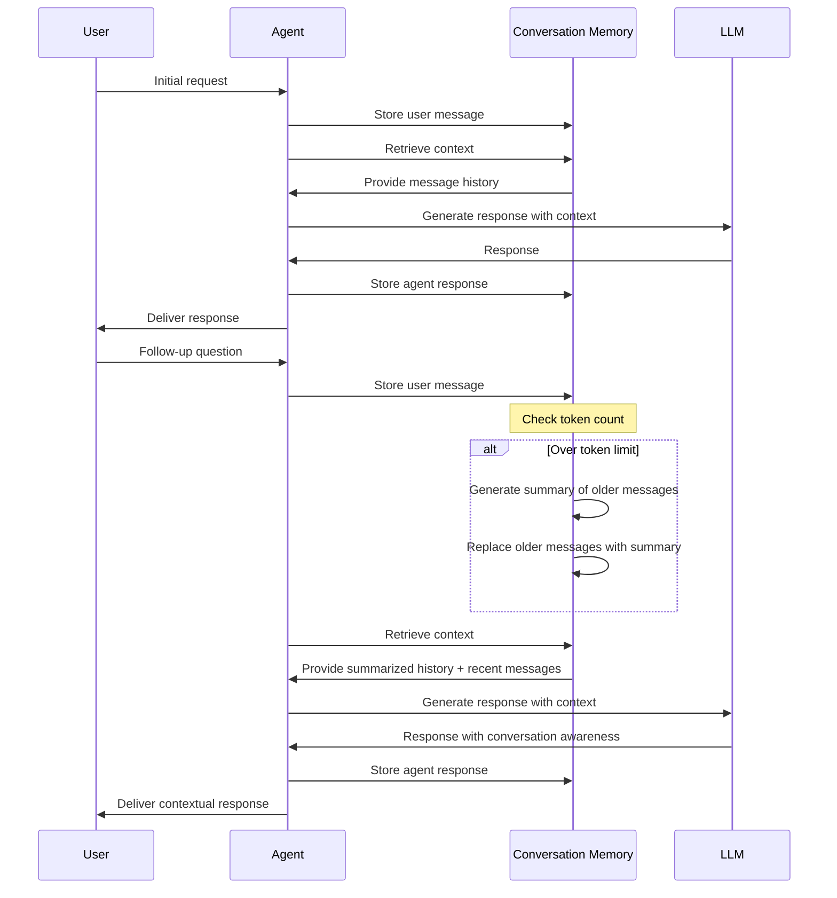
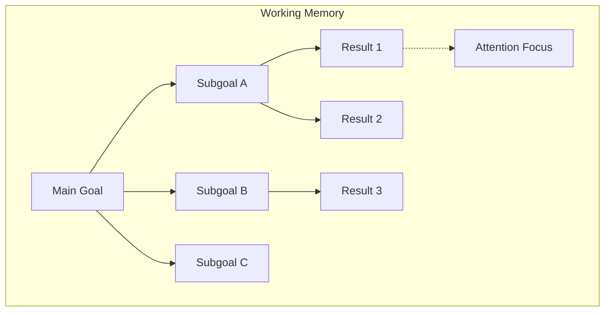
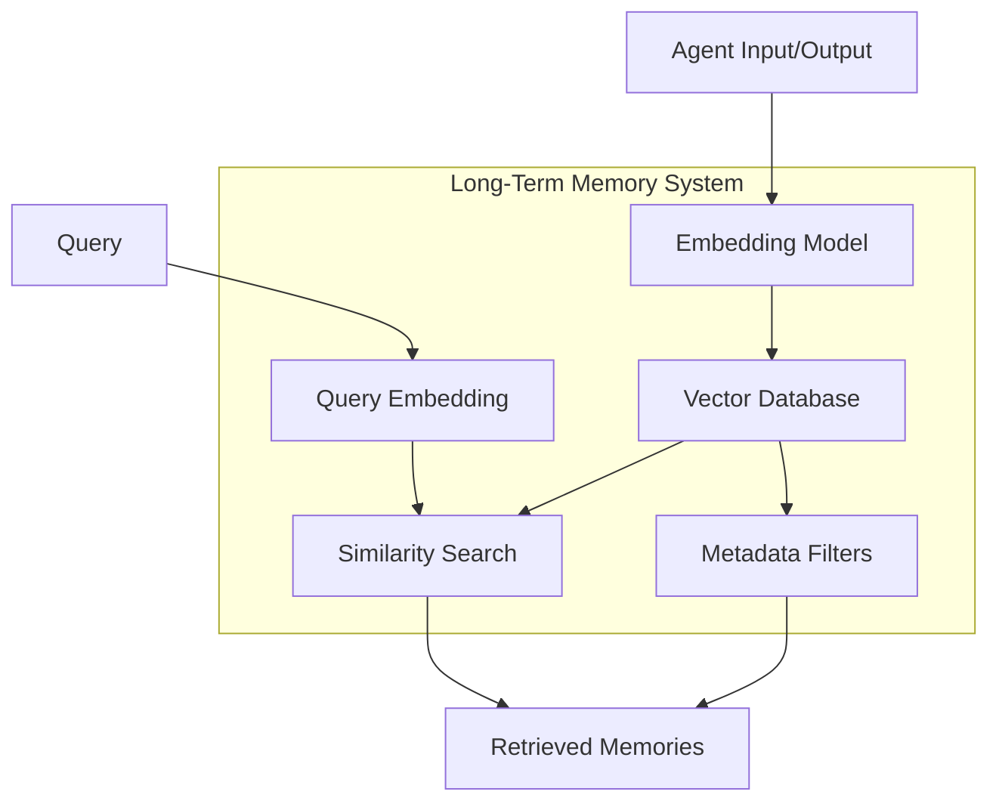
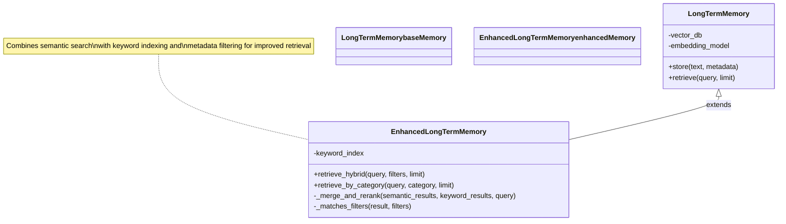
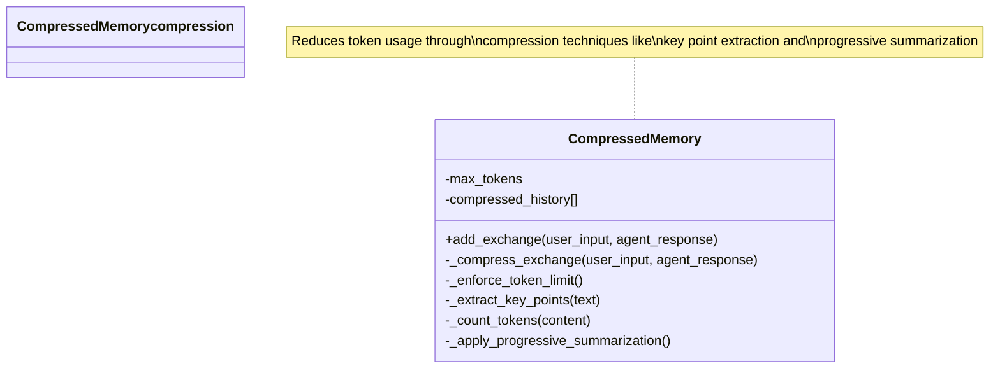
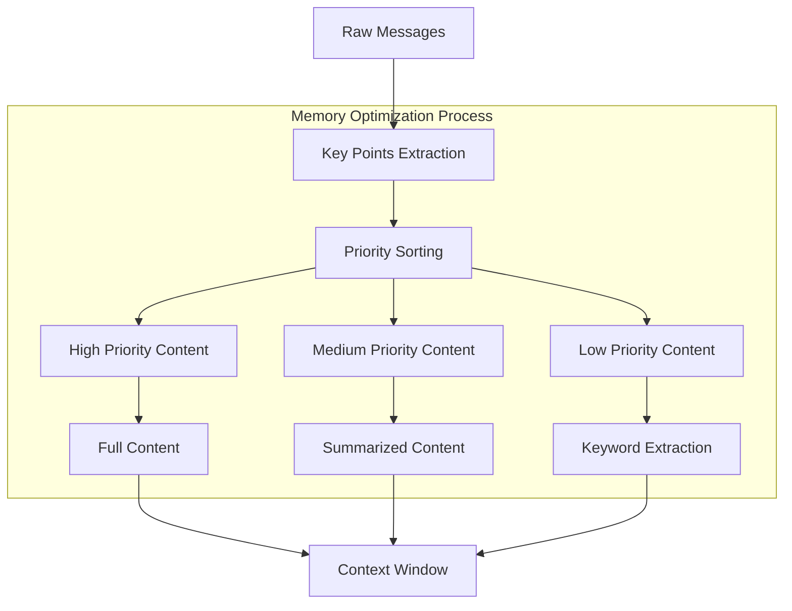

# Memory and State Patterns

*Effective memory systems are the foundation of intelligent agent behavior. This chapter explores patterns for implementing memory in AI agents, addressing the challenges of context limitations while optimizing for both short-term responsiveness and long-term knowledge retention.*
w
## Introduction

AI agents, like humans, need memory systems to function effectively. Without memory, agents operate in isolation, treating each interaction as if it were the first and losing valuable context that could inform better responses. However, implementing memory in LLM-based systems presents unique challenges:

1. **Context Window Limitations**: LLMs have fixed context windows, limiting how much conversation history and knowledge can be included in prompts.
2. **Persistence Requirements**: Truly useful agents must maintain state between sessions and recall important information over time.
3. **Information Prioritization**: Not all information deserves equal attention; agents must learn to prioritize what to remember.

This chapter presents four essential patterns for memory implementation in AI agents, each addressing a different aspect of agent memory architecture:

- **Conversation Memory Pattern**: For maintaining coherent multi-turn interactions
- **Working Memory Pattern**: For managing task-specific state during complex operations
- **Long-Term Memory Pattern**: For persistent knowledge storage and retrieval
- **Memory Optimization Pattern**: For maximizing effectiveness within context constraints

## Context Management Pattern

At the heart of effective agent systems is the challenge of context management—providing the right information at the right time to enable informed decisions and responses while avoiding information overload. Context management goes beyond simply storing data; it involves the dynamic selection and prioritization of relevant information.

### Pattern Structure

The Context Management Pattern consists of:

1. A context selection mechanism that determines what information is relevant for the current task
2. A context prioritization system that ranks information by importance when space is limited
3. Dynamic context updating that evolves the available information as conversations progress
4. Context relevance scoring to filter out irrelevant or outdated information

**Diagram:**


**Narrative Example:**
Consider an agent helping with travel planning:

Initially, the agent might include in its context only basic user preferences and the destination. As the conversation progresses to flight booking, the context expands to include specific dates, airport preferences, and budget constraints. Later, when discussing accommodations, the flight details become less immediately relevant and may be summarized, while accommodation preferences become more prominent in the context.

The context management process involves:

1. **Situation Assessment**: Analyzing the current state of the conversation to determine what type of context is needed
2. **Information Retrieval**: Gathering relevant information from various memory systems
3. **Context Composition**: Assembling the selected information into a coherent context for the LLM
4. **Context Updating**: Modifying the available context as new information emerges

### Vector Databases for Context Retrieval

One powerful technique for implementing context management is the use of vector databases, which enable semantic search capabilities:

```python
class VectorContextManager:
    def __init__(self, vector_db):
        self.vector_db = vector_db

    def retrieve_relevant_context(self, current_query, k=5):
        """Retrieve context relevant to the current query."""
        # Convert query to vector embedding
        query_embedding = self.embed_text(current_query)

        # Retrieve semantically similar content
        context_items = self.vector_db.similarity_search(
            query_embedding,
            k=k
        )

        return self.format_context(context_items)
```

This approach allows the agent to retrieve information based on meaning rather than exact keyword matches, enabling more intuitive connections between the current situation and relevant past information.

### Balancing Context

The key challenge in context management is balance—providing enough information for informed decisions without overwhelming the agent's reasoning capacity. Effective implementation requires:

- **Selective Inclusion**: Only including truly relevant information
- **Progressive Disclosure**: Adding detail as needed rather than all at once
- **Contextual Summarization**: Compressing information while preserving essential meaning
- **Recency Bias**: Favoring newer information unless older information has special relevance

By treating context as a dynamic, carefully curated resource rather than a simple accumulation of data, agents can maintain coherence across complex interactions while operating within the constraints of limited context windows.

## Memory Systems Hierarchy

Before diving into individual patterns, it's important to understand how different memory systems relate to each other in an agent architecture.


In this hierarchy:

- **Conversation Memory** captures the immediate interaction context between user and agent
- **Working Memory** maintains state for specific tasks, calculations, or multi-step processes
- **Long-Term Memory** stores persistent information that should remain available across multiple sessions

Each layer serves a specific purpose in the agent's cognitive architecture, with information flowing both ways: from user input through conversation memory to reasoning, and from long-term storage back to reasoning to generate informed responses.

Effective agents implement all three memory types, but the specific patterns used in each layer can vary based on use case requirements, resource constraints, and complexity considerations.

## Conversation Memory Pattern

The Conversation Memory Pattern enables agents to maintain context across multiple interaction turns, creating a coherent conversation experience rather than treating each request in isolation.

### Pattern Structure

The basic structure of conversation memory includes:

1. A chronological log of messages exchanged between user and agent
2. Metadata about each message (timestamp, speaker role, etc.)
3. Mechanisms to manage context window constraints
4. Methods to retrieve relevant history for each new interaction

**Diagram:**


**Narrative Example:**
Consider a virtual travel assistant helping a user plan a vacation:

In the initial interaction, the user says, "I'm planning a trip to Italy in September." The agent acknowledges this and stores two key pieces of information: the destination (Italy) and timing (September).

When the user follows up with "What's the weather like there?", the conversation memory provides context that "there" refers to Italy in September. Without this memory, the agent would need to ask "Where and when are you looking for weather information?"

As the conversation continues over many turns, discussing flights, accommodations, and activities, the context window may fill up. At this point, the agent employs a summarization strategy:

1. The agent identifies older conversation turns about initial planning
2. It creates a summary like "User is planning a trip to Italy in September, has booked flights arriving in Rome on September 3rd and departing from Milan on September 17th"
3. It replaces the detailed early messages with this compact summary
4. It preserves the most recent messages about current activity planning in detail

This allows the conversation to continue with full context awareness even beyond what would fit in the LLM's context window.

The sequence of operations in conversation memory is illustrated below:

**Diagram:**


### Context Window Management

Since LLMs have fixed context windows, effective management of conversation history is critical. Several strategies can be employed:

1. **Sliding Window**: Keep only the most recent N messages or tokens
2. **Summarization**: Replace older messages with summaries to preserve essential content
3. **Selective Retention**: Preserve messages based on importance or relevance metrics
4. **Interleaved Summarization**: Alternate between detailed messages and summaries

The simplest approach is the sliding window, but it's often insufficient for complex interactions where early context matters.

### Summarization Approaches

Summarization is key to managing conversation history effectively. An effective approach might work as follows:

1. Set a "summary trigger" threshold (e.g., when conversation reaches 3000 tokens)
2. When triggered, identify older message segments for summarization
3. Generate a concise summary of those segments, preserving key information
4. Replace the detailed messages with the summary to reduce token usage
5. Keep the most recent messages intact for immediate context

Effective summarization requires balancing compression with information preservation. For advanced implementations, consider:

- Using the LLM itself to generate summaries of previous conversation segments
- Maintaining multiple summary levels (recent, medium-term, full conversation)
- Extracting and preserving key entities and commitments made during the conversation

### Example: Customer Support Agent

Consider an AI agent handling customer support inquiries. Effective conversation memory allows the agent to:

1. Remember customer details without repeated requests
2. Track the specific issue across multiple explanation attempts
3. Recall previous troubleshooting steps that were already attempted

A sophisticated implementation might:
- Extract and store customer identification information separately
- Maintain a structured list of attempted solutions
- Track customer sentiment throughout the interaction
- Prioritize retention of diagnostic information
- Create categorized summaries (customer details, problem description, attempted solutions)

This approach not only tracks the raw conversation but also extracts and organizes key information to make it more accessible for the agent's reasoning.

## Working Memory Pattern

### Purpose and Structure

The Working Memory Pattern manages task-specific information during complex operations. Unlike conversation memory, which is primarily chronological, working memory is organized around:

- The current task or goal
- Key information needed to complete the task
- Intermediate results and state

Working memory enables agents to:

- Track progress on multi-step tasks
- Remember intermediate calculations or findings
- Maintain awareness of the current goal and subgoals

### Implementation

Working memory is typically implemented as a structured object with task-specific fields:

```mermaid
classDiagram
    class WorkingMemory {
        -current_goal
        -subgoals[]
        -completion_status{}
        -intermediate_results{}
        -attention_focus
        +set_goal(goal)
        +add_subgoal(subgoal)
        +complete_subgoal(subgoal)
        +store_result(key, value)
        +set_attention(focus)
    }

    note for WorkingMemory "Maintains state for the\ncurrent task and tracks\nprogress toward goals"

    classDef workingMemory fill:#4B0082,color:white
    class WorkingMemory workingMemory
```

### Task-Focused State Management

For complex tasks, working memory needs to track state in a way that's:

1. **Structured**: Organized to reflect task requirements
2. **Prioritized**: Highlighting the most relevant information
3. **Progressive**: Capturing evolution of understanding and results



*Figure 4.2: Working Memory Structure - Depicts task-focused state management with goals, subgoals, results, and attention focus.*

### Attention Mechanisms

Effective working memory requires attention mechanisms to highlight the most relevant information. Implementations include:

- **Recency**: Prioritizing most recently added information
- **Relevance Scoring**: Using similarity to current goal to rank information
- **Explicit Focusing**: Allowing the agent to manually focus on specific elements

```mermaid
classDiagram
    class WorkingMemory {
        -current_goal
        -subgoals[]
        -completion_status{}
        -intermediate_results{}
        -attention_focus
        +set_goal(goal)
        +add_subgoal(subgoal)
        +complete_subgoal(subgoal)
        +store_result(key, value)
        +set_attention(focus)
    }

    class AttentionAwareWorkingMemory {
        -relevance_scores{}
        +update_relevance(query)
        +get_focused_context(max_items)
    }

    WorkingMemory <|-- AttentionAwareWorkingMemory : extends

    note for AttentionAwareWorkingMemory "Prioritizes information based on\nrelevance to the current query\nor focus of attention"

    classDef baseClass fill:#9370DB,color:white
    classDef attentionClass fill:#4B0082,color:white

    class WorkingMemory baseClass
    class AttentionAwareWorkingMemory attentionClass
```

### Example: Research Assistant Agent

A research assistant agent needs working memory to track information during complex research tasks:

```mermaid
classDiagram
    class WorkingMemory {
        -current_goal
        -subgoals[]
        -completion_status{}
        -intermediate_results{}
    }

    class ResearchWorkingMemory {
        -search_queries[]
        -key_findings[]
        -sources[]
        -contradictions[]
        -questions_to_explore[]
        +add_finding(finding, source)
        +get_research_state()
    }

    WorkingMemory <|-- ResearchWorkingMemory : extends

    note for ResearchWorkingMemory "Specialized working memory\nfor research tasks, tracking\nfindings, sources, and contradictions"

    classDef baseClass fill:#9370DB,color:white
    classDef specializedClass fill:#4B0082,color:white

    class WorkingMemory baseClass
    class ResearchWorkingMemory specializedClass
```

This implementation tracks not just information but relationships between findings, enabling more sophisticated reasoning about the research domain.

## Long-Term Memory Pattern

### Purpose and Structure

The Long-Term Memory Pattern provides persistent storage and retrieval of information across sessions. Unlike the previous patterns which operate primarily within a session, long-term memory:

- Persists beyond individual conversations
- Accumulates knowledge over time
- Requires efficient retrieval mechanisms to be useful

Long-term memory enables agents to:

- Recognize returning users and recall their preferences
- Build up domain expertise from past interactions
- Avoid repeating mistakes or relearning information

### Implementation

Long-term memory typically relies on vector databases for semantic retrieval:

```mermaid
classDiagram
    class LongTermMemory {
        -vector_db
        -embedding_model
        +store(text, metadata)
        +retrieve(query, limit)
    }

    class VectorDB {
        +add(embedding, text, metadata)
        +search(embedding, limit)
    }

    class EmbeddingModel {
        +embed(text)
    }

    LongTermMemory --> VectorDB : uses
    LongTermMemory --> EmbeddingModel : uses

    note for LongTermMemory "Persists information across\nsessions using semantic search\nfor retrieval"
    note for VectorDB "Stores vector embeddings\nand enables similarity search"

    classDef primary fill:#4B0082,color:white
    classDef component fill:#9370DB,color:white

    class LongTermMemory primary
    class VectorDB,EmbeddingModel component
```

### Vector Storage Approaches

There are several approaches to implementing vector storage for long-term memory:

1. **Dedicated Vector Databases**: Purpose-built solutions like Pinecone, Weaviate, or Milvus
2. **Vector Extensions**: Extensions to traditional databases like pgvector for PostgreSQL
3. **Hybrid Solutions**: Combining vector search with keyword indexing for better retrieval



*Figure 4.3: Long-Term Memory Architecture - Shows vector storage and retrieval process with embedding generation and similarity search.*

### Retrieval Mechanisms

Effective long-term memory requires sophisticated retrieval mechanisms:

1. **Semantic Search**: Finding content similar to the current context
2. **Metadata Filtering**: Narrowing results by user, domain, time period, etc.
3. **Hybrid Retrieval**: Combining semantic and keyword-based approaches
4. **Retrieval-Augmented Generation (RAG)**: Using retrieved content to enhance responses



### Example: Personal Productivity Assistant

A personal productivity assistant uses long-term memory to become more helpful over time:

```mermaid
classDiagram
    class EnhancedLongTermMemory {
        +store(text, metadata)
        +retrieve_hybrid(query, filters, limit)
    }

    class ProductivityAssistantMemory {
        -user_id
        -ltm
        -user_preferences{}
        -recurring_tasks[]
        -important_dates[]
        +store_interaction(conversation)
        +get_relevant_context(current_query)
        -_extract_tasks(conversation)
        -_extract_preferences(conversation)
        -_extract_important_dates(conversation)
        -_is_relevant(key, query)
        -_is_upcoming(date)
    }

    ProductivityAssistantMemory --> EnhancedLongTermMemory : uses

    note for ProductivityAssistantMemory "Specializes memory for productivity contexts,\ntracking user preferences, tasks, and dates\nwhile storing conversations for retrieval"

    classDef component fill:#9370DB,color:white
    classDef specialized fill:#4B0082,color:white

    class EnhancedLongTermMemory component
    class ProductivityAssistantMemory specialized
```

This implementation combines structured data (preferences, tasks, dates) with unstructured conversation memory, enabling rich contextual responses that improve over time.

## Memory Optimization Pattern

### Purpose and Structure

The Memory Optimization Pattern addresses the challenge of maximizing information utility within context window constraints. It focuses on:

- Efficient encoding of information
- Prioritization of the most relevant content
- Dynamic adjustment based on task requirements

Effective memory optimization enables agents to:

- Handle more complex tasks within fixed context limits
- Maintain better conversation coherence over extended interactions
- Balance immediate context needs with historical information

### Implementation Strategies

#### 1. Compression Techniques

Several techniques can reduce the token footprint of stored information:



#### 2. Selective Retention

Not all information deserves equal priority in memory:

```mermaid
classDiagram
    class SelectiveMemory {
        -max_items
        -items[]
        -importance_scores{}
        +add_item(item, initial_importance)
        -_update_importance_scores()
        -_prune_items()
    }

    note for SelectiveMemory "Prioritizes information\nbased on importance scores\nand removes least important\nitems when space is limited"

    classDef selective fill:#4B0082,color:white
    class SelectiveMemory selective
```

#### 3. Chunking and Summarization

Hierarchical organization can improve information density:

```mermaid
classDiagram
    class ChunkedMemory {
        -chunks[]
        -summaries{}
        +add_chunk(content, chunk_id)
        +get_hierarchical_view()
        +expand_chunk(chunk_id)
        -_generate_summary(content)
    }

    class MemoryChunk {
        +id
        +content
    }

    ChunkedMemory o-- "*" MemoryChunk : contains

    note for ChunkedMemory "Organizes information into chunks\nwith summaries for efficient\nhierarchical access"

    classDef main fill:#4B0082,color:white
    classDef component fill:#9370DB,color:white

    class ChunkedMemory main
    class MemoryChunk component
```

### Advanced Optimization Techniques

For cutting-edge memory optimization:

1. **Information Density Analysis**: Evaluating content by information/token ratio
2. **Adaptive Summarization**: Varying summary detail based on importance
3. **Memory Reconstruction**: Recreating details from compressed representations
4. **Information Layering**: Organizing memory in detail layers from summary to full



*Figure 4.4: Memory Optimization Flow - Illustrates the process of prioritizing and compressing information for efficient context usage.*

### Example: Context Management for Large Problems

When working on complex problems that exceed context capabilities, dynamic optimization is essential:

```mermaid
classDiagram
    class CodeAssistanceMemory {
        -max_tokens
        -code_snippets[]
        -requirements[]
        -error_messages[]
        -file_structure{}
        +add_code_snippet(snippet, file_path, relevance)
        +get_optimized_context(current_file, current_error)
        -_count_tokens(text)
        -_create_code_summary(code)
        -_format_context(elements)
    }

    class CodeSnippet {
        +code
        +file
        +relevance
        +timestamp
    }

    CodeAssistanceMemory o-- "*" CodeSnippet : manages

    note for CodeAssistanceMemory "Optimizes context for code assistance by\nprioritizing relevant code snippets,\nerror messages, and requirements"

    classDef main fill:#4B0082,color:white
    classDef component fill:#9370DB,color:white

    class CodeAssistanceMemory main
    class CodeSnippet component
```

This approach dynamically balances different types of information based on relevance to the current task, ensuring optimal use of the available context window.

## Integration with Agent Architecture

Memory systems don't exist in isolation - they must be integrated into the agent's core architecture.

```mermaid
classDiagram
    class MemoryAwareAgent {
        -llm
        -conversation_memory
        -working_memory
        -long_term_memory
        +process_input(user_input)
        -_create_context(current_input, ltm_results, working_state)
        -_update_working_memory(user_input, response)
        -_update_long_term_memory(user_input, response)
    }

    class ConversationMemory {
        +add_message(role, content)
    }

    class WorkingMemory {
        +get_current_state()
    }

    class LongTermMemory {
        +retrieve(query)
    }

    MemoryAwareAgent --> ConversationMemory : uses
    MemoryAwareAgent --> WorkingMemory : uses
    MemoryAwareAgent --> LongTermMemory : uses

    note for MemoryAwareAgent "Integrates all memory types to\nprovide comprehensive context\nfor agent responses"

    classDef agent fill:#4B0082,color:white
    classDef memory fill:#9370DB,color:white

    class MemoryAwareAgent agent
    class ConversationMemory,WorkingMemory,LongTermMemory memory
```

## Conclusion

Effective memory systems are essential for building agents that maintain coherence, learn over time, and efficiently manage information within context constraints. The patterns presented in this chapter provide a framework for implementing memory systems that address:

- Short-term conversation context
- Task-specific working memory
- Long-term knowledge retention
- Optimization for context window efficiency

By mixing and matching these patterns, developers can create memory architectures tailored to their specific agent requirements, balancing the tradeoffs between memory depth, computational efficiency, and implementation complexity.

As context window sizes increase and retrieval techniques improve, we can expect agent memory systems to become increasingly sophisticated. However, the fundamental patterns described here will remain relevant as they address the core cognitive requirements of any intelligent agent.

## Further Reading

- [Building RAG-based LLM Applications for Production](https://arxiv.org/abs/2312.06648)
- [Context-faithful Prompting for Large Language Models](https://arxiv.org/abs/2303.11315)
- [Enhancing Chat History Management in LLM Applications](https://dx.doi.org/10.2139/ssrn.4602291)
- [In-Context Learning and Memory in Large Language Models](https://arxiv.org/abs/2211.05742)