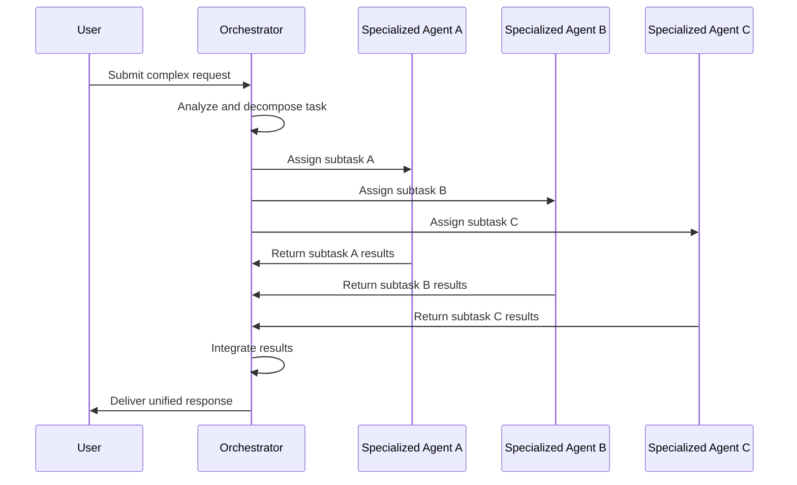
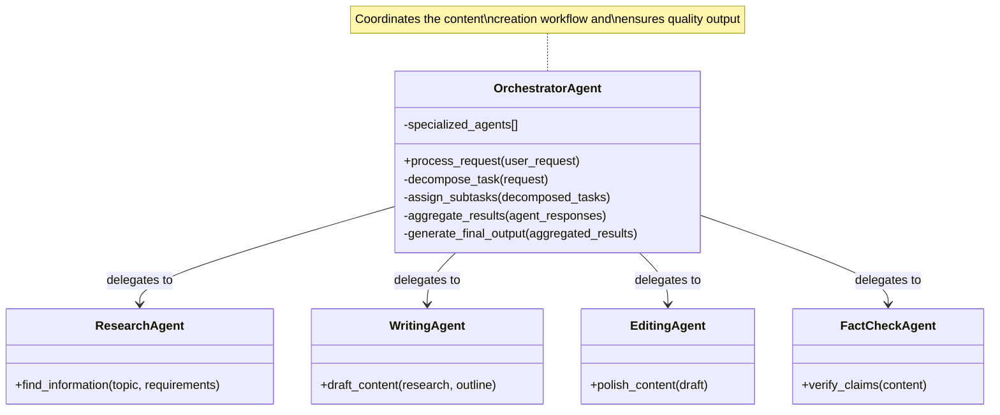
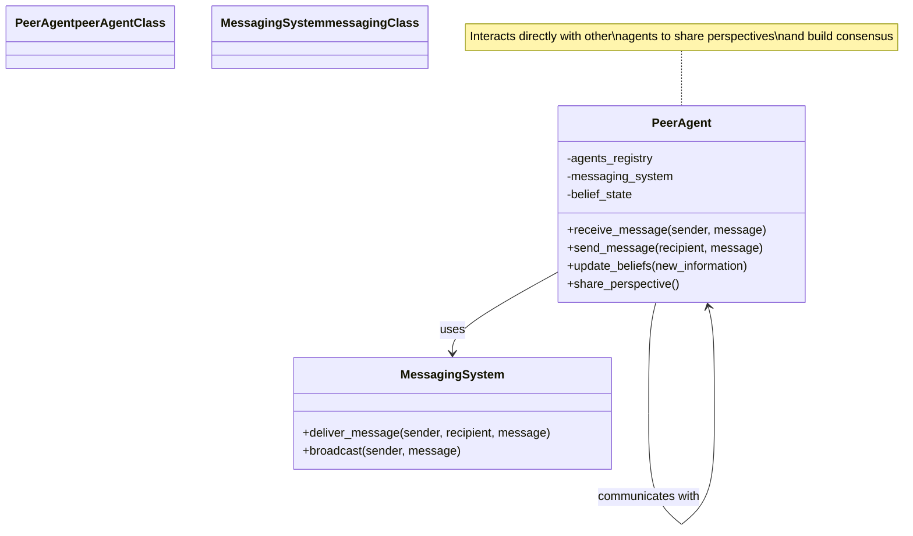
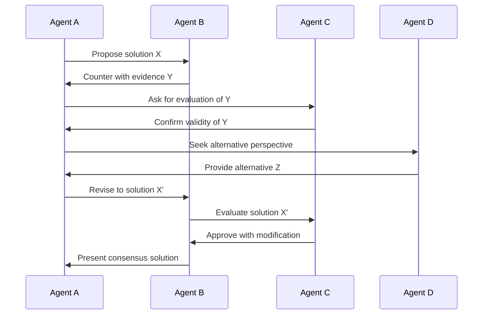
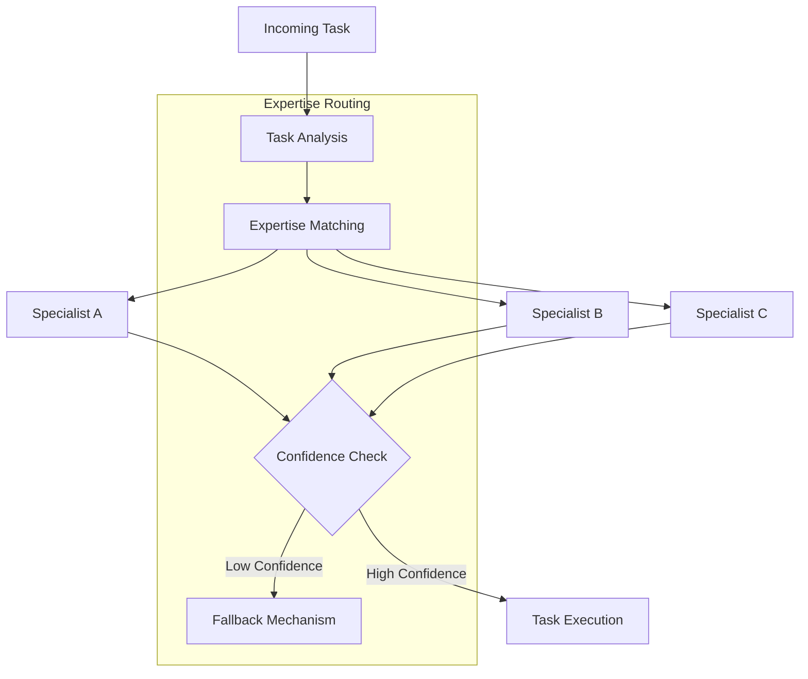
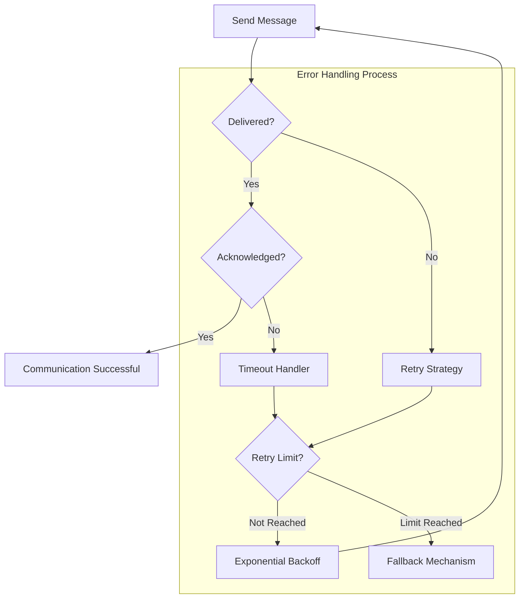

# Multi-Agent Patterns

*Multi-agent systems leverage the power of specialized agents working together to solve complex problems. This chapter explores patterns for designing effective multi-agent architectures, addressing challenges of coordination, communication, and task decomposition while maximizing the benefits of agent specialization.*

## Introduction

As AI agents become more sophisticated, there's a growing recognition that complex tasks often benefit from a division of labor. Rather than building monolithic agents that attempt to handle every aspect of a problem, multi-agent architectures distribute responsibilities across specialized components. This approach mirrors successful organizational patterns in human teams, where specialization and collaboration lead to superior outcomes.

Implementing multi-agent systems presents several unique challenges:

1. **Coordination Complexity**: Determining how agents should communicate and coordinate their activities.
2. **Task Decomposition**: Breaking down complex problems into appropriate subtasks for specialized agents.
3. **Result Integration**: Combining the outputs from multiple agents into coherent, unified responses.
4. **Balancing Autonomy and Control**: Determining how much decision-making authority to grant individual agents.

This chapter presents four essential patterns for implementing multi-agent systems, each addressing a different aspect of multi-agent architecture:

- **Orchestrator Pattern**: For coordinating specialized agents from a central controller
- **Peer Network Pattern**: For enabling direct communication between agents in collaborative tasks
- **Specialization Pattern**: For designing specialized agents with well-defined expertise boundaries
- **Communication Protocol Pattern**: For standardizing message formats and information exchange

## Multi-Agent Architecture Fundamentals

Before diving into individual patterns, it's important to understand the fundamental architectural considerations in multi-agent systems.


In designing a multi-agent system, several key decisions must be made:

1. **Coordination Structure**: Will agents be organized hierarchically, as peers, or in some hybrid arrangement?
2. **Communication Methods**: Will agents communicate synchronously or asynchronously, directly or through intermediaries?
3. **Task Allocation**: Will tasks be assigned by a central coordinator or will agents bid for tasks?
4. **Conflict Resolution**: How will disagreements between agents be resolved?

An effective multi-agent architecture carefully considers these questions in light of the specific problem domain and requirements.

## Orchestrator Pattern

The Orchestrator Pattern implements a hierarchical approach to multi-agent systems, with a central coordinator that decomposes tasks, delegates to specialized agents, and integrates results.

### Pattern Structure

The basic structure of the Orchestrator Pattern includes:

1. A central orchestrator agent that manages the overall process
2. Multiple specialized agents with distinct capabilities
3. A task decomposition mechanism within the orchestrator
4. A result aggregation mechanism to combine agent outputs

**Diagram:**


**Narrative Example:**
Consider a research assistant system helping a user investigate a complex topic:

When the user requests information about "the economic impacts of renewable energy adoption," the orchestrator agent analyzes this request and decomposes it into subtasks:

1. The orchestrator identifies key aspects: economic factors, renewable energy technologies, and global adoption trends
2. It delegates these subtasks to specialized agents:
   - An economics agent researches financial implications
   - A technology agent gathers information on renewable energy systems
   - A data analysis agent compiles adoption statistics
3. Each specialized agent works independently on its assigned subtask
4. The orchestrator collects results from all agents, identifies connections between their findings
5. Finally, it synthesizes a comprehensive response that integrates insights from all agents

This approach allows for depth in each subtopic while ensuring the final response is coherent and addresses the original request holistically.

The sequence of operations in the Orchestrator Pattern is illustrated below:



### Task Decomposition Strategies

Effective task decomposition is critical for the Orchestrator Pattern. Several strategies can be employed:

1. **Domain-Based Decomposition**: Dividing tasks based on knowledge domains
2. **Process-Based Decomposition**: Breaking down tasks based on processing steps
3. **Data-Based Decomposition**: Allocating tasks based on different data sources or formats
4. **Goal-Based Decomposition**: Dividing tasks based on different objectives or sub-goals

The choice of decomposition strategy depends on the nature of the problem and the specializations of available agents.

### Result Aggregation Approaches

Once specialized agents complete their tasks, the orchestrator must aggregate their outputs effectively:

1. **Sequential Integration**: Building on each agent's output in a defined order
2. **Parallel Synthesis**: Combining all outputs simultaneously using a merging strategy
3. **Hierarchical Composition**: Organizing outputs in a hierarchical structure
4. **Conflict Resolution**: Resolving contradictions between agent outputs

Effective orchestrators often employ multiple aggregation strategies depending on the task context.

### Example: Content Creation System

Consider a multi-agent content creation system tasked with producing comprehensive blog posts:



This implementation allows each specialized agent to focus on its core competency while the orchestrator manages the overall process flow, resulting in higher quality content than a single agent could produce.

## Peer Network Pattern

### Purpose and Structure

The Peer Network Pattern implements a collaborative approach where agents communicate directly with each other without a central coordinator. This pattern is particularly useful for:

- Collaborative reasoning tasks
- Debate and consensus building
- Simulating multiple perspectives

Unlike the hierarchical structure of the Orchestrator Pattern, the Peer Network establishes agents as equals that interact directly.

### Implementation

A peer network typically includes:

1. Multiple agents with defined roles or perspectives
2. Direct communication channels between agents
3. A shared protocol for message exchange
4. Mechanisms for reaching consensus



### Consensus Building Mechanisms

For peer networks to reach useful conclusions, they need mechanisms for building consensus:

1. **Voting Protocols**: Allowing agents to vote on proposed solutions
2. **Belief Revision**: Updating beliefs based on evidence from other agents
3. **Argumentation Frameworks**: Formalizing the process of argument and counterargument
4. **Collaborative Filtering**: Combining perspectives with weighted importance



*Figure 5.2: Peer Network Consensus - Shows how individual agent perspectives contribute to shared knowledge and consensus.*

### Example: Debate System

A multi-agent debate system can implement the Peer Network Pattern to explore multiple perspectives on complex issues:

```mermaid
classDiagram
    class DebateAgent {
        -perspective
        -belief_state
        -reasoning_process
        +propose_argument(topic)
        +evaluate_argument(argument)
        +counter_argument(argument)
        +update_beliefs(new_evidence)
    }

    class PerspectiveA {
        -domain_knowledge_A
    }

    class PerspectiveB {
        -domain_knowledge_B
    }

    class PerspectiveC {
        -domain_knowledge_C
    }

    DebateAgent <|-- PerspectiveA : extends
    DebateAgent <|-- PerspectiveB : extends
    DebateAgent <|-- PerspectiveC : extends

    note for DebateAgent "Base agent with debate capabilities"
    note for PerspectiveA "Represents specific viewpoint A"
    note for PerspectiveB "Represents specific viewpoint B"
    note for PerspectiveC "Represents specific viewpoint C"

    classDef baseClass fill:#9370DB,color:white
    classDef perspectiveClass fill:#4B0082,color:white

    class DebateAgent baseClass
    class PerspectiveA,PerspectiveB,PerspectiveC perspectiveClass
```

This implementation allows multiple perspectives to engage in structured debate, challenging assumptions and building toward a more nuanced understanding than any single agent could provide.

## Specialization Pattern

### Purpose and Structure

The Specialization Pattern focuses on creating agents with well-defined areas of expertise. Rather than building general-purpose agents, this pattern encourages:

- Deep expertise in narrow domains
- Clear interface definitions between specialists
- Explicit mapping of tasks to appropriate specialists

Specialization enables systems to leverage the benefits of focused training and optimization while maintaining coherent overall functionality.

### Implementation

Implementing the Specialization Pattern involves:

1. Identifying distinct areas of expertise needed for the system
2. Defining clear boundaries between specializations
3. Creating consistent interfaces for interaction
4. Establishing mechanisms for matching tasks to specialists

```mermaid
classDiagram
    class SpecialistAgent {
        -domain_knowledge
        -expertise_boundaries
        -capability_description
        +process_task(task)
        +provide_capability_description()
        +check_task_suitability(task)
    }

    class DomainExpertAgent {
        -domain_specific_knowledge
        -specialized_reasoning
        +analyze_domain_problem(problem)
    }

    class ToolExpertAgent {
        -tool_api_knowledge
        -tool_execution_logic
        +execute_tool_task(task)
    }

    class MethodExpertAgent {
        -specialized_methods
        -analysis_techniques
        +apply_specialized_method(data)
    }

    SpecialistAgent <|-- DomainExpertAgent : extends
    SpecialistAgent <|-- ToolExpertAgent : extends
    SpecialistAgent <|-- MethodExpertAgent : extends

    note for SpecialistAgent "Abstract base class for\nall specialist agents"

    classDef base fill:#4B0082,color:white
    classDef specialist fill:#9370DB,color:white

    class SpecialistAgent base
    class DomainExpertAgent,ToolExpertAgent,MethodExpertAgent specialist
```

### Expertise Boundary Management

A critical aspect of the Specialization Pattern is managing expertise boundaries:

1. **Explicit Domain Definitions**: Clearly defining what each specialist knows
2. **Capability Advertisements**: Having agents declare what they can handle
3. **Task Routing Mechanisms**: Ensuring tasks reach the appropriate specialists
4. **Fallback Handling**: Managing situations where no specialist is suitable



*Figure 5.3: Expertise Routing Process - Shows the process of matching tasks to appropriate specialists.*

### Example: Medical Diagnosis System

A multi-agent medical system demonstrates the Specialization Pattern effectively:

```mermaid
classDiagram
    class MedicalAgent {
        +evaluate_symptoms(symptoms)
        +provide_diagnosis()
        +suggest_treatment()
    }

    class Cardiologist {
        -cardiac_knowledge_base
        +assess_heart_condition(symptoms)
    }

    class Neurologist {
        -neural_knowledge_base
        +assess_neurological_condition(symptoms)
    }

    class Radiologist {
        -imaging_expertise
        +interpret_scan(imaging_data)
    }

    MedicalAgent <|-- Cardiologist : specializes as
    MedicalAgent <|-- Neurologist : specializes as
    MedicalAgent <|-- Radiologist : specializes as

    note for MedicalAgent "Common medical agent interface"
    note for Cardiologist "Specializes in heart conditions"
    note for Neurologist "Specializes in neurological conditions"
    note for Radiologist "Specializes in medical imaging"

    classDef baseClass fill:#9370DB,color:white
    classDef specializationClass fill:#4B0082,color:white

    class MedicalAgent baseClass
    class Cardiologist,Neurologist,Radiologist specializationClass
```

This approach allows each specialist to maintain deep expertise in their domain while providing a consistent interface for diagnosis and treatment recommendations.

## Communication Protocol Pattern

### Purpose and Structure

The Communication Protocol Pattern establishes standards for how agents exchange information. Effective communication protocols ensure:

- Clear, unambiguous message exchange
- Consistent handling of requests and responses
- Reliable state synchronization between agents
- Graceful error handling

Standardized communication is essential for all multi-agent systems, regardless of their specific architecture.

### Implementation

A robust communication protocol typically includes:

1. Defined message formats and schemas
2. Standard request-response patterns
3. Error handling conventions
4. State synchronization mechanisms

```mermaid
classDiagram
    class MessageProtocol {
        +message_type
        +sender_id
        +recipient_id
        +content
        +metadata
        +timestamp
        +validate()
        +serialize()
        +deserialize()
    }

    class TaskAssignmentMessage {
        +task_description
        +deadline
        +priority
        +required_capabilities
    }

    class ResultReportMessage {
        +task_id
        +result_data
        +confidence_score
        +processing_metadata
    }

    class QueryMessage {
        +query_content
        +response_format
        +context_information
    }

    MessageProtocol <|-- TaskAssignmentMessage : extends
    MessageProtocol <|-- ResultReportMessage : extends
    MessageProtocol <|-- QueryMessage : extends

    note for MessageProtocol "Base protocol for all\nagent communications"

    classDef baseProtocol fill:#4B0082,color:white
    classDef messageType fill:#9370DB,color:white

    class MessageProtocol baseProtocol
    class TaskAssignmentMessage,ResultReportMessage,QueryMessage messageType
```

### Message Exchange Patterns

Several standard patterns can be used for agent communication:

1. **Request-Response**: Simple question and answer exchange
2. **Publish-Subscribe**: Broadcast updates to interested subscribers
3. **Event Notification**: Asynchronous alerts about state changes
4. **Streaming**: Continuous data flow between agents


*Figure 5.4: Message Exchange Patterns - Illustrates different communication patterns between agents.*

### Error Handling and Recovery

Robust communication protocols must address potential failures:

1. **Message Acknowledgment**: Confirming message receipt
2. **Timeout Handling**: Managing non-responsive agents
3. **Retry Strategies**: Policies for resending failed messages
4. **Fallback Mechanisms**: Alternative actions when communication fails



*Figure 5.5: Error Handling Flow - Shows the process of managing communication failures.*

### Example: Document Processing Pipeline

A document processing system demonstrates the Communication Protocol Pattern:

```mermaid
classDiagram
    class DocumentProcessor {
        +process_document(document)
    }

    class OCRService {
        +extract_text(image)
    }

    class ClassificationService {
        +categorize_document(text)
    }

    class DataExtractionService {
        +extract_fields(text, document_type)
    }

    class CommunicationProtocol {
        +format_request(service, action, data)
        +parse_response(service_response)
        +handle_error(error, service)
    }

    DocumentProcessor --> CommunicationProtocol : uses
    DocumentProcessor --> OCRService : communicates with
    DocumentProcessor --> ClassificationService : communicates with
    DocumentProcessor --> DataExtractionService : communicates with

    note for CommunicationProtocol "Standardizes all inter-service\ncommunication with consistent\nformats and error handling"

    classDef serviceClass fill:#9370DB,color:white
    classDef protocolClass fill:#4B0082,color:white

    class DocumentProcessor,OCRService,ClassificationService,DataExtractionService serviceClass
    class CommunicationProtocol protocolClass
```

This approach ensures that document processing services can communicate reliably, with consistent message formats and error handling across all service interactions.

## Integration with Agent Architecture

Multi-agent patterns don't exist in isolation—they must be integrated into the overall agent architecture and combined effectively.

```mermaid
classDiagram
    class MultiAgentSystem {
        -coordination_strategy
        -communication_protocol
        -agents[]
        +process_task(task)
        -coordinate_agents(decomposed_tasks)
        -integrate_results(agent_outputs)
    }

    class OrchestratorStrategy {
        +decompose_task(task)
        +assign_subtasks(agents, tasks)
        +aggregate_results(outputs)
    }

    class PeerNetworkStrategy {
        +facilitate_communication(agents)
        +build_consensus(perspectives)
    }

    class CommunicationProtocol {
        +format_message(sender, recipient, content)
        +deliver_message(message)
        +handle_errors(error_type)
    }

    class SpecializedAgent {
        -expertise_domain
        +process_subtask(task)
    }

    MultiAgentSystem --> OrchestratorStrategy : may use
    MultiAgentSystem --> PeerNetworkStrategy : may use
    MultiAgentSystem --> CommunicationProtocol : uses
    MultiAgentSystem o-- SpecializedAgent : contains

    note for MultiAgentSystem "Integrates multiple patterns to\ncreate a complete multi-agent system"

    classDef system fill:#4B0082,color:white
    classDef component fill:#9370DB,color:white

    class MultiAgentSystem system
    class OrchestratorStrategy,PeerNetworkStrategy,CommunicationProtocol,SpecializedAgent component
```

## Conclusion

Multi-agent systems offer powerful approaches for addressing complex problems through specialization, collaboration, and coordination. The patterns presented in this chapter provide frameworks for implementing effective multi-agent architectures that address:

- Task decomposition and coordination through the Orchestrator Pattern
- Collaborative reasoning through the Peer Network Pattern
- Expertise specialization through the Specialization Pattern
- Reliable communication through the Communication Protocol Pattern

By mixing and matching these patterns, developers can create multi-agent systems tailored to their specific requirements, balancing the tradeoffs between coordination overhead, communication complexity, and implementation difficulty.

As AI agents become more sophisticated, multi-agent architectures will likely become increasingly important for solving complex problems that benefit from diverse perspectives and specialized expertise. The fundamental patterns described here will remain relevant as they address the core challenges inherent in any collaborative intelligent system.

## Further Reading

- [Multi-Agent Systems: Algorithmic, Game-Theoretic, and Logical Foundations](https://doi.org/10.1017/CBO9780511811654)
- [Emergent Communication in Multi-Agent Systems](https://arxiv.org/abs/2006.02419)
- [Cooperative Multi-Agent Reinforcement Learning](https://arxiv.org/abs/2011.00583)
- [The Future of Multi-Agent Systems Research](https://doi.org/10.1007/s10458-008-9040-0)
- As we discussed in [Chapter 4: Memory and State Patterns](04_memory_and_state_patterns.md), memory sharing is a key consideration in multi-agent systems