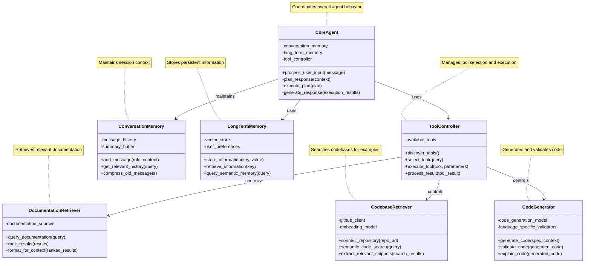
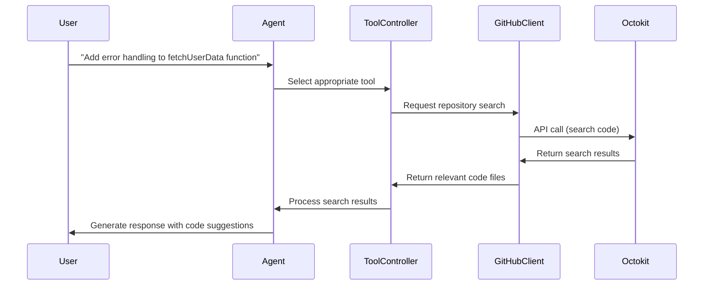
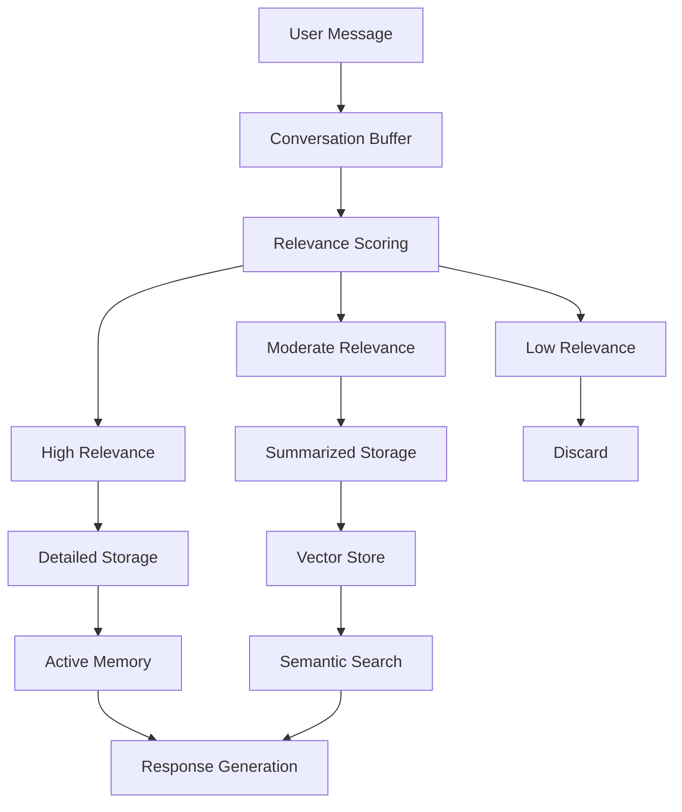
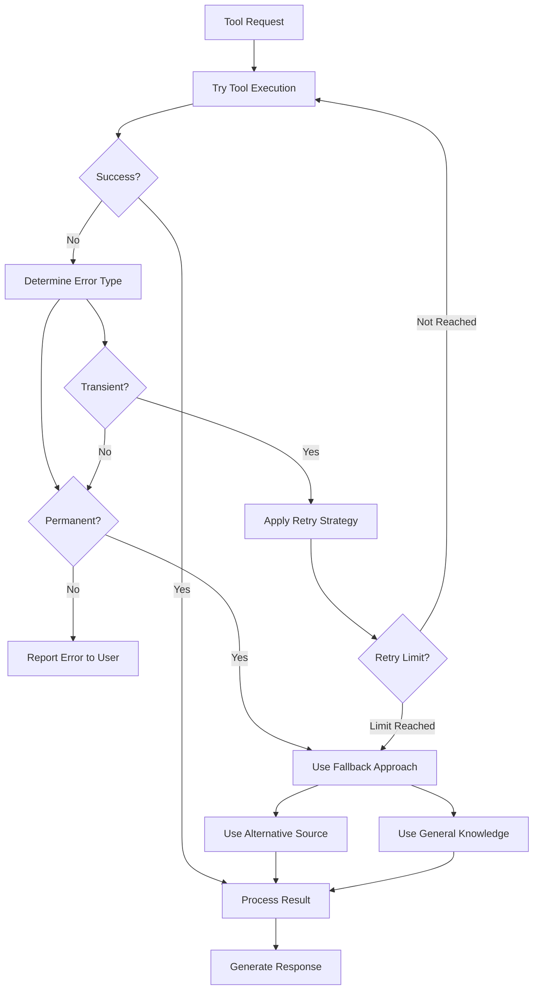

# Case Study: Building a Retrieval-Enhanced Development Assistant

*This capstone chapter brings together the patterns from previous chapters to build a practical, complete AI agent example. By examining the development of a coding assistant that retrieves relevant documentation and code examples, we'll see how different patterns combine to create a powerful agent system.*

## Introduction

Throughout this book, we've explored various patterns for designing effective AI agents. In this chapter, we'll apply these patterns to build a practical retrieval-enhanced development assistant—a coding companion that helps developers write code by providing relevant documentation, examples, and suggestions.

This case study demonstrates how to integrate multiple patterns into a cohesive system that solves real-world problems. By following the development of this assistant, you'll gain insight into:

- How to select appropriate patterns for specific requirements
- How patterns from different domains complement each other
- Practical considerations when implementing a complete agent system
- Trade-offs and optimizations in real-world implementations

## Assistant Requirements

Before diving into the architecture, let's clarify what our development assistant needs to accomplish:

### Capabilities and Constraints

The development assistant must:

1. Understand coding-related questions across multiple programming languages
2. Access relevant documentation from official sources
3. Retrieve appropriate code examples from a codebase
4. Integrate with GitHub for repository context awareness
5. Remember conversation context to provide consistent help
6. Generate accurate, runnable code suggestions
7. Respect rate limits and latency requirements

### User Interaction Patterns

The assistant will support the following user interaction flows:

1. **Documentation lookup**: "How do I use the pandas `DataFrame.groupby` method?"
2. **Repository-aware code suggestions**: "Write a function to parse this JSON format in our codebase"
3. **Debugging assistance**: "Why am I getting this error in my React component?"
4. **Dependency management**: "What's the best library for handling authentication in Express?"

### Performance Considerations

The assistant must operate within these performance parameters:

1. Response latency under 2 seconds for retrieval-only operations
2. Response latency under 5 seconds for complex code generation
3. Memory usage that stays within the context window limits
4. Reliability when external services experience temporary outages

## Architecture Overview

Let's map our requirements to specific patterns from previous chapters to create our architecture.


### Pattern Selection and Rationale

Our architecture incorporates the following patterns from previous chapters:

1. **Agent Component Pattern** (Chapter 1): We'll structure our assistant with clear components for input processing, planning, and execution.

2. **Agent Loop Pattern** (Chapter 1): The assistant will implement a continuous loop of observation, planning, execution, and reflection.

3. **Protocol-Based Agent Pattern** (Chapter 2): We'll use protocol-based integration for GitHub and documentation services.

4. **Function Calling Pattern** (Chapter 3): For structured access to external tools and APIs.

5. **Retrieval Augmentation Pattern** (Chapter 3): To enhance the assistant with relevant documentation and code examples.

6. **Conversation Memory Pattern** (Chapter 4): To maintain context across user interactions.

7. **Long-Term Memory Pattern** (Chapter 4): For persistent storage of user preferences and frequently referenced documentation.

8. **Specialization Pattern** (Chapter 5): To divide responsibilities among specialized components for documentation retrieval, code analysis, and generation.

### Component Interaction Diagram

The high-level architecture consists of these components interacting as follows:



### Implementation Considerations

When implementing this architecture, several considerations influenced our design decisions:

1. **Model Selection**: We chose a model with strong coding capabilities as the foundation but enhanced it with retrieval for improved accuracy.

2. **Tool Integration Strategy**: Rather than building all capabilities into the model, we leveraged external tools and APIs for specialized functions.

3. **Memory Architecture**: We implemented a tiered memory system with different retention policies for different types of information.

4. **Error Handling**: We designed the system to gracefully degrade when external services are unavailable.

## Key Implementation Details

### Protocol Selection for Tool Integration

For GitHub integration, we implemented the Protocol-Based Agent Pattern as follows:



We selected the GitHub REST API over GraphQL for broader compatibility and implemented rate limit awareness to prevent service disruptions.

### Memory System Design

The memory system combines Conversation Memory and Long-Term Memory patterns:



This tiered approach balances context richness with efficiency:

1. **Active Memory**: Stores recent, highly relevant exchanges in full detail
2. **Summarized Memory**: Keeps condensed versions of moderately relevant information
3. **Vector Store**: Enables semantic retrieval of historical information when needed

### Error Handling Approach

We implemented a comprehensive error handling strategy:

1. **Graceful Degradation**: When GitHub integration fails, the system falls back to general knowledge
2. **Retry Mechanisms**: Implements exponential backoff for transient API failures
3. **Result Validation**: Checks code execution results before presenting to users
4. **Transparent Communication**: Clearly communicates limitations to users when services are impaired



## Lessons Learned

Throughout the development of this assistant, we discovered valuable insights about implementing agent patterns in practice.

### Pattern Adaptations for Specific Needs

Several patterns required adaptation for this specific use case:

1. **Retrieval Augmentation Pattern**: We modified the standard RAG approach to prioritize official documentation and trusted code repositories over general web content.

2. **Conversation Memory Pattern**: We implemented domain-specific relevance scoring that weighs code-related exchanges more heavily than casual conversation.

3. **Long-Term Memory Pattern**: We added a specialized index for programming languages and libraries to speed up retrieval of relevant documentation.

As we discussed in [Chapter 3: Tool Integration Patterns](03_tool_integration_patterns.md), the Function Calling Pattern provided a clean interface for tool integration, but we needed to add validation layers specific to code generation:

```python
def validate_code_generation(generated_code, language):
    """Validates generated code for common issues"""
    if language == "python":
        # Check for syntax errors
        try:
            ast.parse(generated_code)
        except SyntaxError as e:
            return False, f"Syntax error: {str(e)}"

        # Check for import errors
        missing_imports = check_imports(generated_code)
        if missing_imports:
            return False, f"Missing imports: {', '.join(missing_imports)}"

    # Similar checks for other languages

    return True, "Validation passed"
```

### Performance Optimizations

We implemented several optimizations to meet our performance requirements:

1. **Caching Strategy**: Frequently accessed documentation was cached with a time-based invalidation policy.

2. **Parallel Tool Execution**: Non-dependent tools were executed in parallel to reduce latency.

3. **Progressive Response Generation**: We started generating responses before all tool calls completed, updating as results arrived.

4. **Embedding Optimization**: We used chunking and hierarchical embedding strategies to improve retrieval accuracy while minimizing computational overhead.

### Future Extension Opportunities

Based on our experience, several future enhancements would be valuable:

1. **Multi-Agent Specialization**: Following the patterns from [Chapter 5: Multi-Agent Patterns](05_multi_agent_patterns.md), dividing responsibilities among specialized agents could improve both quality and performance.

2. **Enhanced Self-Reflection**: Implementing more sophisticated self-evaluation loops would help the assistant learn from past interactions.

3. **Local Code Execution**: Adding a sandboxed execution environment would enable testing generated code before presenting it to users.

4. **Personalization Layer**: Deeper integration with the Long-Term Memory Pattern could enable personalized assistance based on user coding style and preferences.

## Conclusion

This case study demonstrates how patterns from throughout this book can be combined to create a practical, powerful AI agent system. By thoughtfully selecting and integrating patterns from agent components, architectural frameworks, tool integration, memory systems, and multi-agent collaboration, we've created a development assistant that provides real value to users.

The key insights from this implementation include:

1. **Pattern Complementarity**: Patterns from different domains enhance each other, creating a system greater than the sum of its parts.

2. **Practical Adaptation**: Theoretical patterns often require adaptation to meet practical requirements.

3. **Performance Balance**: A successful agent balances capability, performance, and reliability.

4. **Progressive Enhancement**: Starting with core patterns and progressively enhancing functionality allows for iterative improvement.

As you develop your own agent systems, consider how these patterns might apply to your specific requirements, and don't hesitate to adapt them as needed. The patterns in this book provide a foundation, but your creativity and domain knowledge will guide their application in practice.

## References

- [GitHub REST API Documentation](https://docs.github.com/en/rest)
- [Retrieval-Augmented Generation for Knowledge-Intensive NLP Tasks](https://arxiv.org/abs/2005.11401)
- [ReAct: Synergizing Reasoning and Acting in Language Models](https://arxiv.org/abs/2210.03629)
- [Patterns for Building LLM-based Systems & Products](https://eugeneyan.com/writing/llm-patterns/)
- [Software Engineering for AI-Enabled Systems](https://cmu-seai.github.io/)